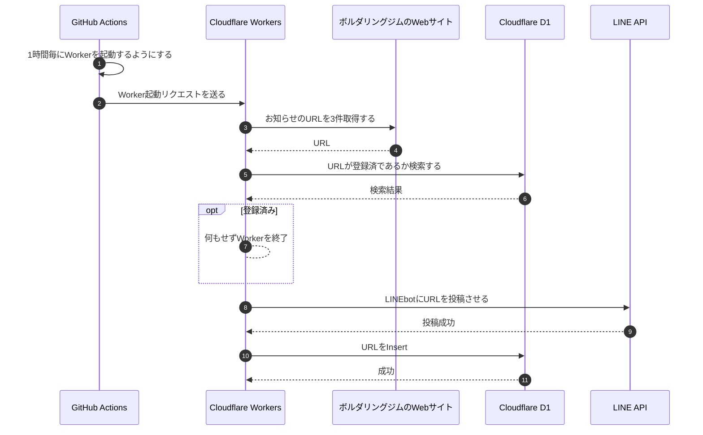

# bouldering-gym-notifier

ボルダリングジムの更新を知らせるボット

## シーケンス

```mermaid
sequenceDiagram
    autonumber
    participant action as GitHub Actions
    participant worker as Cloudflare Workers
    participant web as ボルダリングジムのWebサイト
    participant db as Cloudflare D1
    participant line as LINE API

    action->>action: 1時間毎にWorkerを起動するようにする
    action->>worker: Worker起動リクエストを送る
    worker->>web: お知らせのURLを3件取得する
    web-->>worker: URL
    worker->>db: URLが登録済であるか検索する
    db-->>worker: 検索結果
    opt 登録済み
        worker-->worker: 何もせずWorkerを終了
    end
    worker->>line: LINEbotにURLを投稿させる
    line-->>worker: 投稿成功
    worker->>db: URLをInsert
    db-->>worker: 成功
```

## インフラ構成
