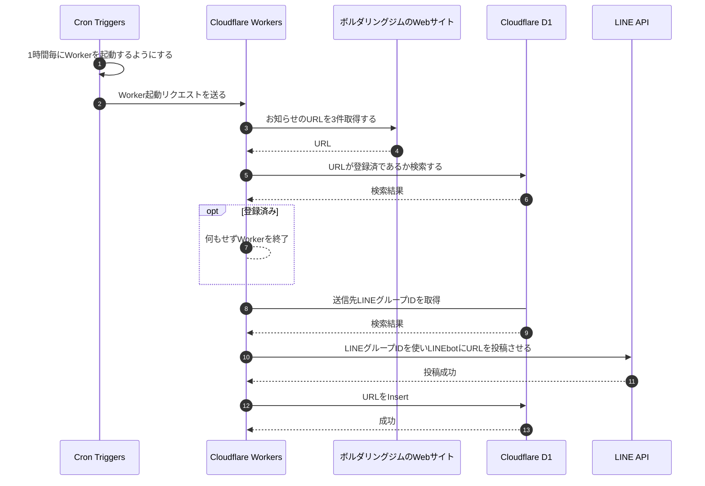

# bouldering-gym-notifier

ボルダリングジムの更新を知らせるボット

## ディレクトリ構成

モノレポで行う

```bash

bouldering-gym-notifier
├── notifier Cronでスクレイピングと通知を定期実行
└── line-webhook HonoでLINEからのWebhookを受け取り、送信先グループIDなどを受け取る
```

## シーケンス



## インフラ構成


